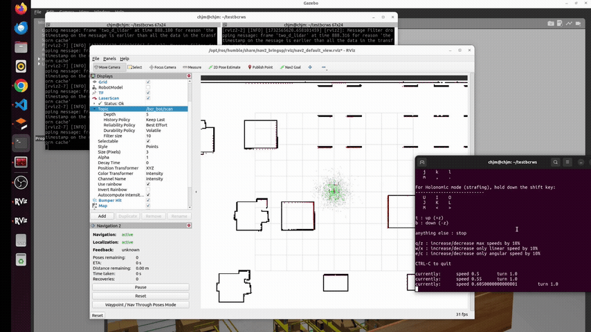
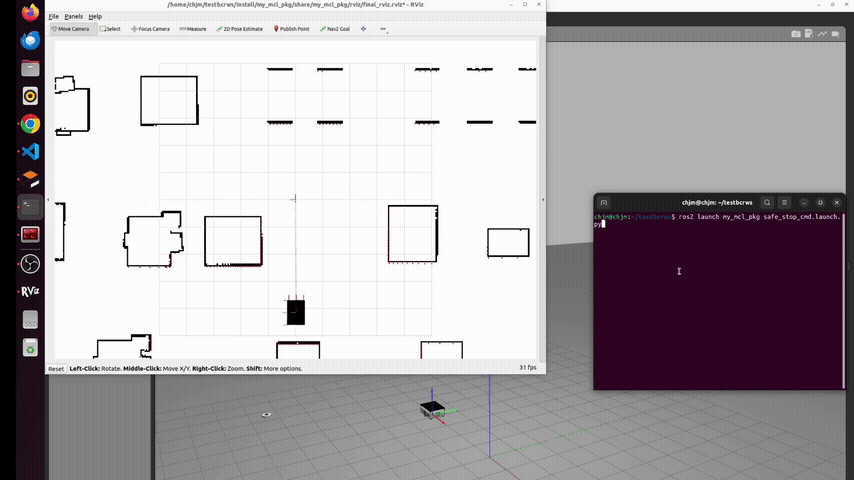

# MCL and Safe Stop with BCR Bot on ROS2 Humble

This project enhances the open-source robot **bcr_bot** by implementing:
1. A **safe stop** mechanism for preventing collisions.
2. Reimplementation of **Monte Carlo Localization (MCL)** in **ROS2 Humble** using Python, based on the NAV2 server.

bcr_bot link: https://github.com/blackcoffeerobotics/bcr_bot


The project utilizes the following software and dependencies:
- **Ubuntu Version:** 22.04
- **ROS2 Distribution:** Humble
- **Gazebo:** Gazebo 11 Classic
- **Rviz:** Rviz2

---


## **File Structure**
In src_structure.txt

---

## **Features**
### **Monte Carlo Localization (MCL)**
- Provides a custom implementation of MCL for robot localization.
- Uses NAV2 server for map-to-odom transformations and occupancy grid map
- Init and generate random particles around init pose 
- Predict particles odometry and update with laser scan points 
- Resample if Neff value <50 

**GIF Demonstrations:**
- **MCL in Action:**
- 


- **NAV2 Comparison:**
- 

---

### **Safe Stop Mechanism**
- Prevents collisions by overriding velocity commands when obstacles are detected.
- Supports default velocity settings for smooth and safe navigation.

**GIF Demonstration:**
Safe stop with teleop
- **Safe Stop in Action:**
- 

Safe stop directly with /cmd_vel
- **Safe Stop in Action:**
- 

---


## Quick Start Guide

### 1. Launch the Robot, Gazebo Simulation, and Rviz
To start the robot simulation in Gazebo along with Rviz, run the following command:
```bash
ros2 launch my_mcl_pkg mcl_node.launch.py
```

### 2. Launch the Nav2 Server
This step involves launching the Nav2 server, which looks for the map->odom transform and the map itself:
```bash
ros2 launch bcr_bot nav2.launch.py
```

### 3. Make the Robot Move
To control the robot's movement, use the teleoperation keyboard interface:
```bash
ros2 run teleop_twist_keyboard teleop_twist_keyboard cmd_vel:=/bcr_bot/cmd_vel
```

## Safe Stop Functionality

### Launch Safe Stop with Teleop
First, close any previously running teleop sessions, then run:
```bash
ros2 run teleop_twist_keyboard teleop_twist_keyboard cmd_vel:=/bcr_bot/teleop_cmd_vel
ros2 launch my_mcl_pkg safe_stop.launch.py
```

### Launch Safe Stop Directly Controlling cmd_vel
For direct control over the `cmd_vel`, launch the safe stop as follows:
```bash
ros2 launch my_mcl_pkg safe_stop_cmd.launch.py
